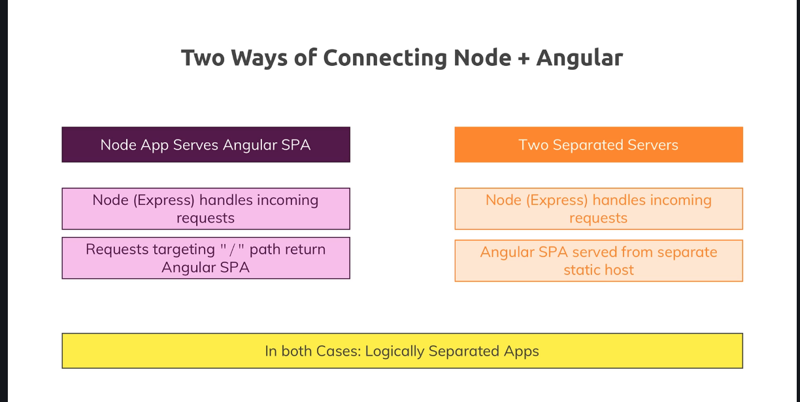

# Angular MEAN app

   NOTE: !!!! note vscode's launch.json !!!!

## excellent express tutorial at

  <https://developer.mozilla.org/en-US/docs/Learn/Server-side/Express_Nodejs>

## Two ways to start backend server(s)

1. node + ng

   - npm run start (starts ang ng server and serves angular SPA)
   - npm run server (serves node express routes and biz logic)

2. node/express only (serves both SPA and biz logic)

   - TBA

## starting MongoDB

## critical notes

- Project structured by feature/component/domain. Sources are:
  - <https://github.com/goldbergyoni/nodebestpractices/blob/master/sections/projectstructre/breakintcomponents.md>
  -

- debugging server (node.js)
  - make sure there's no conflict between version of typescipt and protractor (run npm outdated/update)
  - make sure 'program' (in launch.json) attribute points to proper index.ts (TYPESCRIPT FILE)
  - make sure index.ts is opened (in root)
  - click on debug SIDE icon in vscode to make launch widget appear
  - click on green triangle in top left menu and choose 'Node.js (preview_ to launch debug
  - make sure proper breakpoints in various server files are added
  - use top right menu to drive debgguer actions

- debugging in chrome dev tools:
  - <https://medium.com/the-node-js-collection/debugging-node-js-with-google-chrome-4965b5f910f4>
